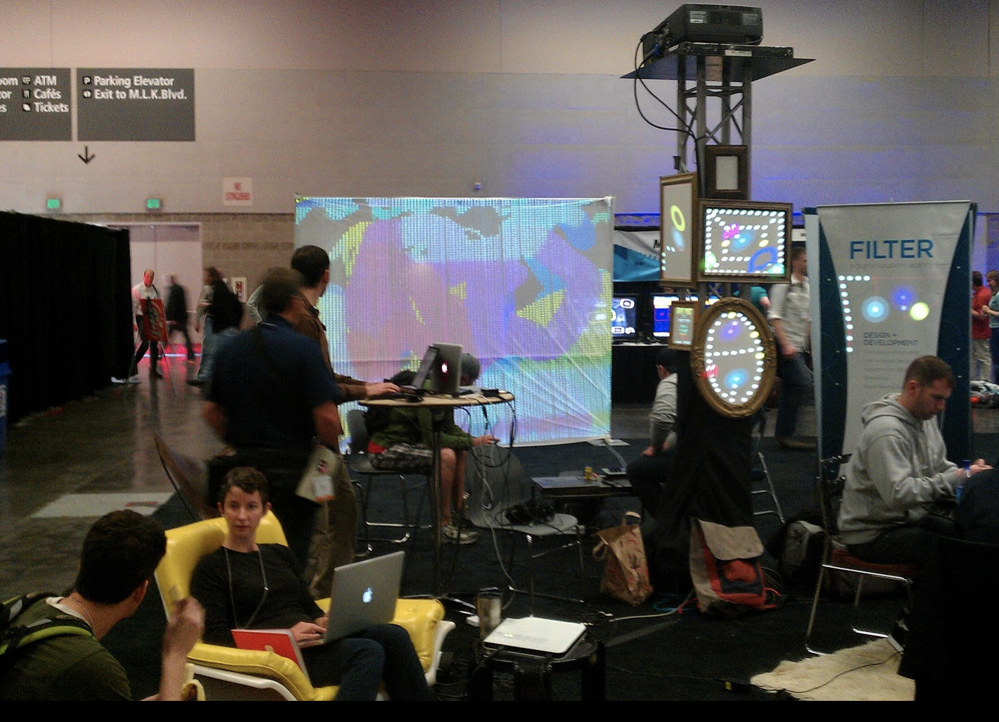
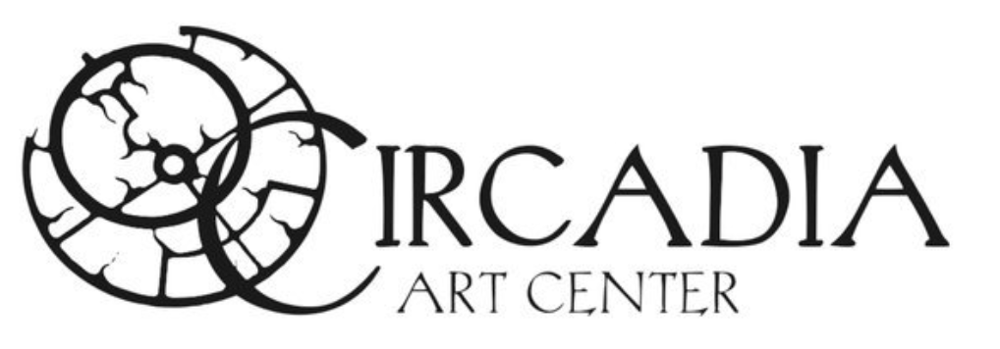
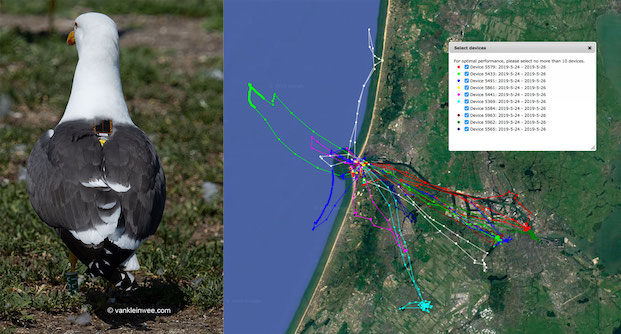
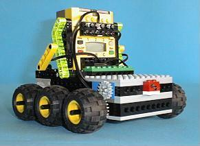
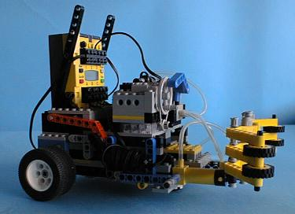

# Timeline of Experience

### February 2021 - Current

Director at [Davis Consulting Services LLC](https://davisconsultingservicesllc.com/)
* Software Development and Architecture<
* DevSecOps
* Application security testing

### January 2020 - February 2021

I was employed by [ThinkMammoth](https://www.mammothhr.com/) as a Senior Engineering Manager
* Member of the senior leadership team 
* Lead a security team and company SOC2 efforts
* Manage a team of frontend developers

### October 2017 - January 2020

I was employed by [CollegeNET](https://collegenet.com/) as a Technical Lead in [Applyweb Self Service](https://www.applyweb.com/applyweb/).
* Lead UI, API and CLI teams focused on providing self service capabilities for ApplyWeb®
* Designed and implemented frontend, backend and DevOPS architecture

I have contributed open source code to [Mattermost](https://mattermost.com/) server, webapp and mobile.  I also have created a handful of plugins.
* [mattermost-plugin-remind](https://github.com/scottleedavis/mattermost-plugin-remind) _sets reminders for users and channels_
* [mattermost-plugin-noexif](https://github.com/scottleedavis/mattermost-plugin-noexif) _removes EXIF information from images_
* [mattermost-plugin-watermark](https://github.com/scottleedavis/mattermost-plugin-watermark) _adds a hidden steganography in images_
* [mattermost-plugin-ascii-plot](https://github.com/scottleedavis/mattermost-plugin-ascii-plot) _converts plot data in post to ascii charts_

### November 2016 - June 2017

I was employed by [Summit Security Group](https://summitinfosec.com/) as a security engineer.

* Produced vulnerability assessments of external and internal systems for clients including code reviews 
* Participated in Social Engineering assessments including physical and phishing exercises

### December 2015 - September 2016

I was employed as a application security researcher at [Rapid7](https://www.rapid7.com/) and worked closely with the development team of [AppSpider](https://www.rapid7.com/products/appspider/).

* [https://github.com/sdavis-r7](https://github.com/sdavis-r7)
* As a team member, we helped forge Application Security practices, products and services.
* As a developer, I planned, built, and deployed the out-of-band vulnerability callback API "AppSpidered" .  I also built the ReactJS scan interface for [AppSpider](https://www.rapid7.com/products/appspider/)
* As a researcher, I discovered [vulnerabilities, wrote exploits, and offered patching to the OpenAPI (Swagger) ecosystem.](https://blog.rapid7.com/2016/06/23/r7-2016-06-remote-code-execution-via-swagger-parameter-injection-cve-2016-5641/)

### May 2013 - December 2015

I was employed by [Webtrends](https://www.webtrends.com/).
* As the Engineering Security Team Lead, I provided vulnerability assessments, code review, threat modeling and built automation to augment existing Continuous Integration workflows.
* As a member of the data services team, I was immersed in all layers of our SaaS components and focused development on data query architecture.  
* As a member of the application team, I wrote client side and server side components for portfolio applications: account settings, action center, optimize, and streams 

### November 2012 - May 2013

I worked at a startup named [Aspen Labs LLC](https://www.aspenlabsnetwork.com/).
* Furthered development in internationalization and visualization elements in products, while also contributing to the architecture of a continuous integration pipeline.  

### March 2010 - November 2012

I cofounded [Collage Creative](https://collagecreative.net/) aimed at providing custom wordpress solutions, as well provided security services for the organization and customers. 

### November 2009 - July 2011

I was a projection interaction artist
* Designed projection light systems for interactive experiences at dance shows, festivals, "OMSI After Dark" and after school programs.  Designed custom extensions to the ruby based [LUZ](https://github.com/lighttroupe/luz) software
* Spearheaded interactive projection gaming at Really Big Video for first Thursday's art walk event in the Pearl District.  Designed, setup and performed projection stage elements for NikeEM 2011

### March 2009 - November 2009

I was a co-founder of [Circadia Art Center](https://www.facebook.com/pages/category/Organization/Circadia-Art-Center-107808282576566/), wearing many hats.
* Information Services:  Network Infrastructure, Surveillance, website, social media
* Business Planning: Articles of Incorporation, Bylaws, Budget, Web-presence, legal contracts
* Business Management:  Event Coordination, Class Scheduling, Alcohol procurement, Tenant relationships

### May 2008 - March 2009

Employed at [nLight Photonics](http://www.nlight.net/) as a software engineer.  I orchestrated the development of kitting algorithms that drove the tiered levels of the diode manufacturing process feeding an ERP system.  I worked closely with engineers in design, implementation and execution of the complete laser product creation, assembly, testing and shipping flow. 

### June 2006 - May 2008

Employed as scientific software engineer and grad student in [Computational Geo Ecology](https://www.nlbif.nl/en/nlbif-data/organizationsresearch-group-computational-geo-ecology-ibed-uva).
* Member of an avian migration studies research team.  
* Data collection: I developed embedded firmware for avian GPS tracking data loggers and co-built the remote data collection system. 
* Mathematical modeling: I created an agent based ecological modeling framework in Matlab, and taught MSc students on its use.
* Visualization: I created and shared as open source, the [Google Earth Toolbox](https://github.com/scottleedavis/google-earth-toolbox).

### September 2005 - May 2006

I worked for [SAPA Aluminum]() as a remote contract software engineer.  I developed Axapta 3.0 modules for the tracking and analysis of aluminum production facilities.

### February 2003 - July 2005

Worked as a senior software engineer at [Taiyo Yuden R&D Center of America](https://www.yuden.co.jp/eu/).  I was responsible for establishing tangible products from components and partnerships guided by leadership.  I was a member of the IEEE 802.15.4 working group, and built several proof of concepts based on low power wireless sensor networks.  Additionally, I wrote firmware and drivers for various projects including keyboards, and wireless network cards.

### September 2002 - December 2002

Worked as a part-time instructor at [Clark Community College](http://www.clark.edu/), Fall 2002 quarter
* CSCI 202 Intro to C++
* Programming with SQL Server 2000
* A+ OS Technologies

### May 2002

* Graduated from [Westminster College](https://westminstercollege.edu/) with 3.73 GPA
* Bemis, NSF, and Westminster Excellence scholarships

I built a voice controlled lego mindstorms project with two robots that maneuvered around an 8'x10' board looking for colored cans and moving them to colored squares.

### June 2000 - July 2002

Worked at [Texscan MSI](http://www.texscan.com/) writing Java, Perl, C and C++
* Built video streaming service for school education
* Developed company website with online purchasing database
* Designed Linux drivers for: Hardware Watchdog, Real-Time Clock

